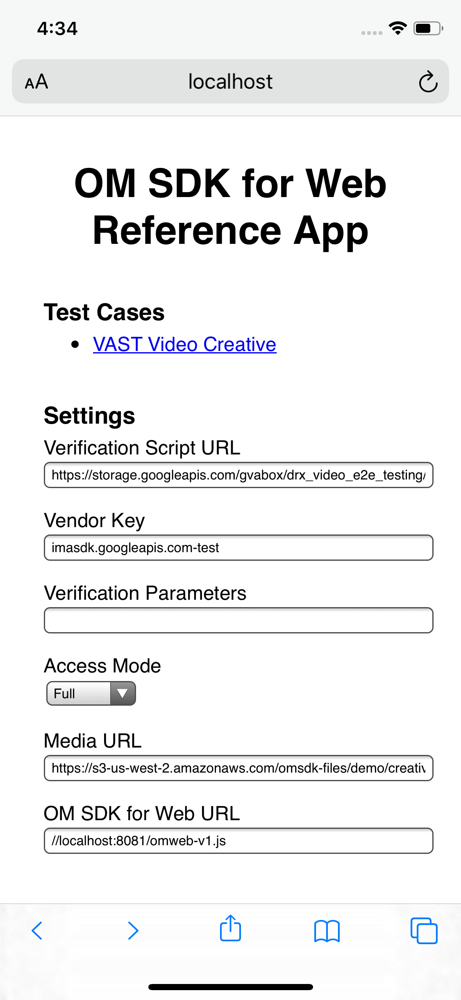
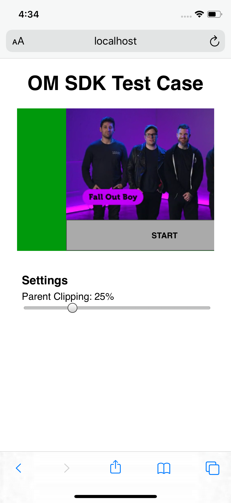

# Open Measurement Reference App for Web

## Overview
A sample web application built to showcase a canonical OM SDK for Web integration.

# Usage

## Prerequisites
* Node v10.16
* NPM v6.9.0

[nvm] is recommended for installing and managing Node and NPM.

## Getting Started
cd reference-app-web
1. Install dependencies with `npm install` or `npm install --legacy-peer-deps`  if you have installed npm in your root directory
2. Copy the dependencies into `static/`: (ALREADY DONE FOR YOU)
    - If in SDKJS repo: Run `npm run buildDeps`
    - If in JSClients repo:
        - Copy the OM SDK for Web into `./static/omweb-v1.js`
        - Copy the OM Domain Loader into `./static/.well-known/omid/omloader-v1.html`
        - Copy the Validation Verification Script into `./static/omid-validation-verification-script-v1.js`
3. Run the dev server by running `npm run start`
4. Open http://localhost:8080 in a browser

## Advanced
If you'd like to specify your own default settings, override the values in `./templates/.settings.default.json`.

# Screenshots

Home and test case pages on iPhone X:

</img>
</img>

# Clarifications
This demo app does not implement parsing of VAST or any other ad response
formats. Asset URLs, verification script URLs and parameters are specified as
constants instead. Please refer to [IAB Tech Lab] for details regarding how
verification resources are represented in various ad formats.

# Additional Information
* [Open Measurement SDK on IAB Tech Lab]

[nvm]: https://github.com/nvm-sh/nvm
[IAB Tech Lab]: https://iabtechlab.com/standards/open-measurement-sdk/
[Open Measurement SDK on IAB Tech Lab]: https://iabtechlab.com/standards/open-measurement-sdk/
